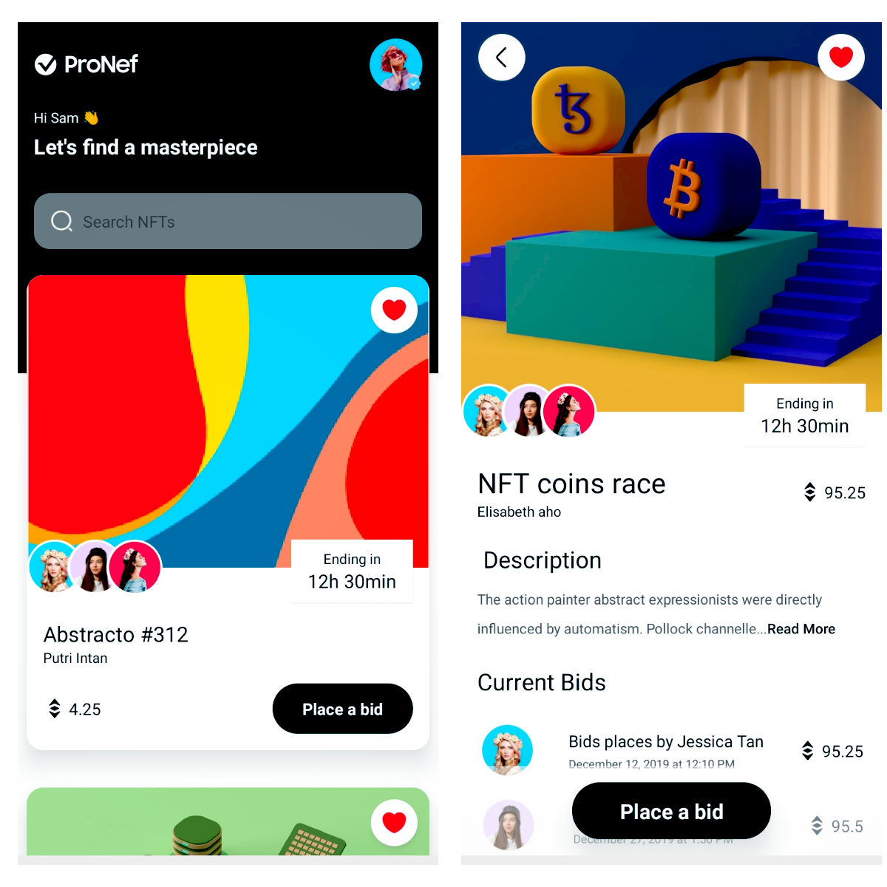

# Project Description

This is a professional landing page of an NFT marketplace app. This Front-End react native app contains two pages. One to show available NFT's and an option to place a bid. The other page dispalys the details of the NFT and also shows current bids.  
This app is optimized for different screen sizes and orientations.

#Installation

Please set up a React Native development environment if you have not already done so.
You will also need to install react native navigation. 
"npm install @react-navigation/native"

# Running iOS on a Mac via a simulator

Make sure you have a version of CocoaPods installed, and run the following commands:

npm i\
cd ios\
pod install\
cd ..\
npm react-native run-ios

# Running Android on a Mac or PC

Attach a device or run an emulator and run the following commands:

npm i\
npm react-native run-android

# Screenshots

# Ideas for Future Development
*Add a Splash Screen.\
*Add an app icon.
